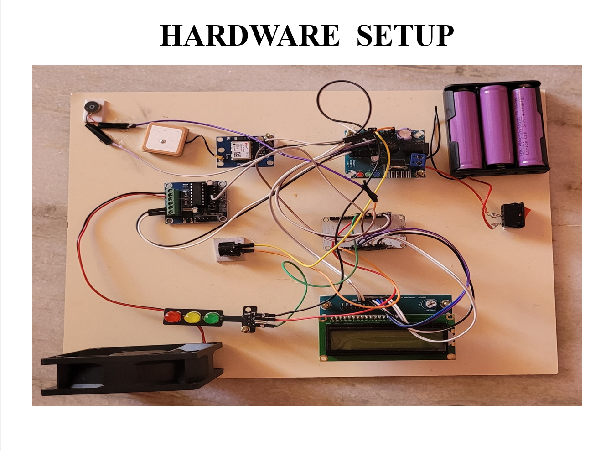
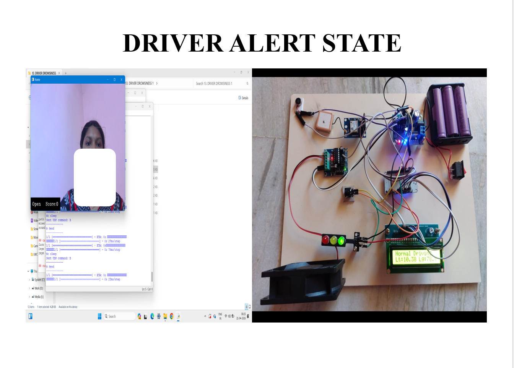
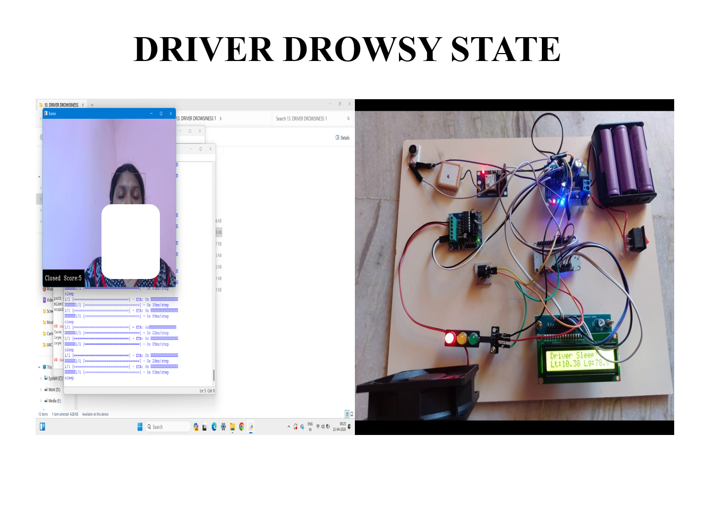
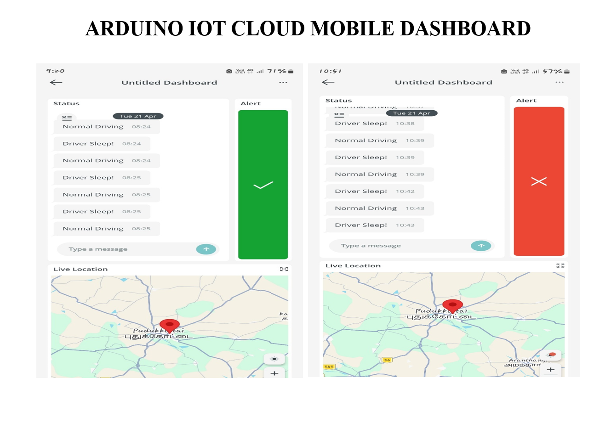
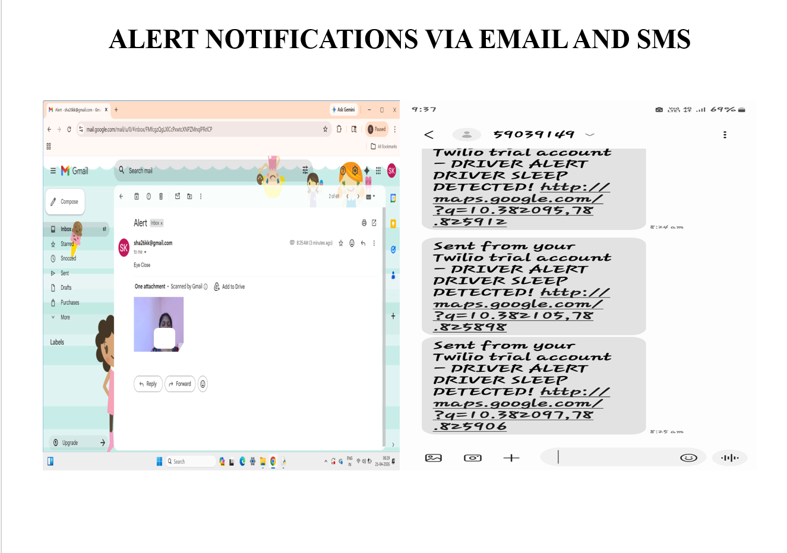
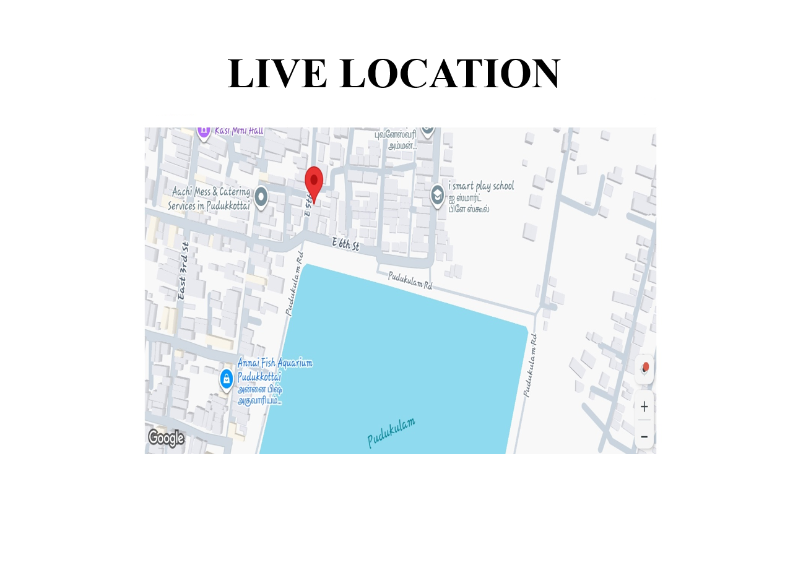

# Automated Driver Drowsiness Detection and Risk Mitigation System Using AI


## Overview

The Automated Driver Drowsiness Detection and Risk Mitigation System is an AI and IoT-based solution designed to improve road safety by detecting driver fatigue in real time. The system continuously monitors the driver's face through a camera and identifies signs of drowsiness using computer vision techniques. When drowsiness is detected, the system immediately activates alerts, slows down the vehicle prototype, sends emergency notifications, and shares the driver's live GPS location.

---

## Getting Started

1. Clone this repository
2. Install required Python libraries: pip install opencv-python mediapipe
3. Open the `.ino` file in Arduino IDE and install the ESP32 board package (via Board Manager) if not already installed
4. Connect the hardware components as per the circuit/block diagram
5. Update your Wi-Fi credentials and Arduino IoT Cloud / Twilio API keys in the code
6. Upload the Arduino code to the ESP32 board
7. Run the Python detection script on your computer with the camera connected
8. Monitor alerts via the Arduino IoT Cloud dashboard, SMS, and Email notifications

---

## Features

- Real-time driver drowsiness detection using AI
- Eye-state monitoring (Eyes Open / Eyes Closed)
- Instant buzzer and LED alerts
- Automatic vehicle speed reduction (prototype)
- Live GPS location tracking
- Arduino IoT Cloud dashboard integration
- SMS and Email notifications
- Real-time monitoring through IoT

---

## Technologies Used

### Programming Languages
- Python
- Arduino (C/C++)

### AI & Computer Vision
- OpenCV
- MediaPipe

### Hardware
- ESP32
- GPS Module
- LCD Display
- Buzzer
- LEDs
- Motor Driver
- DC Motor
- Power Supply

### IoT & Communication
- Arduino IoT Cloud
- Wi-Fi
- Twilio SMS API
- Gmail Notification

---

## Working

1. The camera captures the driver's face continuously.
2. The AI model detects the eye state in real time.
3. If the driver's eyes remain closed beyond the threshold, the system identifies drowsiness.
4. A buzzer and LED warning are activated.
5. The vehicle prototype slows down automatically.
6. The driver's live GPS location is updated on the Arduino IoT Cloud dashboard.
7. SMS and Email alerts are sent with the driver's location.

---

## Project Structure

```
Driver_Drowsiness_Detection.ino
Driver_Drowsiness_Detection_Report.pdf
README.md
images/
```

---

## 📷 Project Outputs

### Hardware Setup



### Driver Alert State (Eyes Open)



### Driver Drowsiness Detection (Eyes Closed)



### Arduino IoT Cloud Mobile Dashboard



### Alert Notifications via Email and SMS



### Live GPS Location Tracking



---

## Applications

- Smart Vehicles
- Road Safety Systems
- Fleet Management
- Driver Monitoring Systems
- Transportation Safety

---

## Future Enhancements

- Mobile application integration
- Cloud database support
- Advanced AI models for higher accuracy
- Driver identity recognition
- Voice-based warning system

---

## Author

**Shanmugapriya Kathiresan**

Bachelor of Engineering (Computer Science and Engineering)

Aspiring Software Engineer

---

## License

This project is developed for educational and academic purposes.

---

## Copyright

Copyright © 2026 Shanmugapriya Kathiresan.

This project is intended for educational, portfolio, and evaluation purposes only.

All rights are reserved.

No part of this source code may be copied, modified, redistributed, or used commercially without prior written permission from the author.


